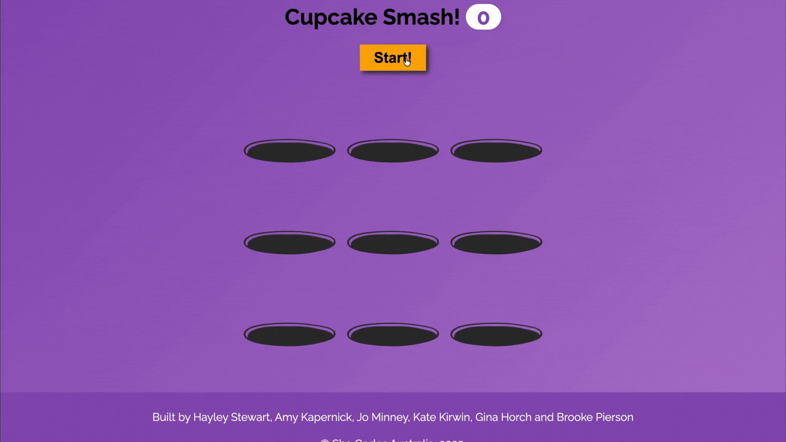

Welcome to our She Codes Australia JavaScript Mini Workshop. We've put together a fun little tutorial to give you a coding taster for a mini game. 

The tutorial teaches you the JavaScript component of our cupcake smashing game. You can take your time and read through concepts to understand more about JavaScript, or you can fly through the content and have fun smashing cupcakes! 

At She Codes we firmly believe that coding is **ALWAYS** better with cupcakes!

A preview of the end result is below:

**New to coding?** Check out the video below for a quick intro to the three languages that power websites - HTML, CSS and JavaScript! You can catch up on it now, or later on at home.

    <iframe 
        style="position: absolute; top: 0; left: 0; width: 100%; height: 100%;" 
        src="https://www.youtube.com/embed/gT0Lh1eYk78?si=PQL5jqUN5_1NFhWh" 
        title="YouTube video player" 
        frameborder="0" 
        allow="accelerometer; autoplay; clipboard-write; encrypted-media; gyroscope; picture-in-picture; web-share" 
        allowfullscreen>
    </iframe>

**Already know the basics?** Jump straight into [Getting Started →](getting_started/) and let's build this game!